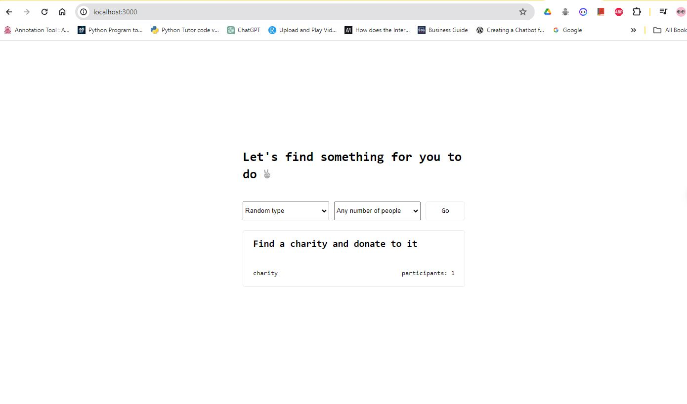

# Server-Side API Requests with Axios
This repository contains the code and materials for the lesson on making server-side API requests using the Axios library, as part of the Angela Web Development course on Udemy.

## Overview
In this lesson, we'll explore how to use the Axios library to make HTTP requests to a server-side API. Axios is a popular JavaScript library that provides a simple and elegant interface for making XMLHttpRequests from the browser and performing CRUD operations on REST endpoints.

Throughout the lesson, we'll cover the following topics:

- Introducing Axios and its features
- Making GET, POST, PUT, and DELETE requests with Axios
- Handling response data and error handling
- Sending headers and query parameters with Axios
- Implementing simple API requests in a web application

The code examples and exercises in this repository will help you practice and solidify your understanding of using Axios for server-side API communication.

## Getting Started
To get started, you'll need to have Node.js and npm (Node Package Manager) installed on your system. Clone this repository, install the dependencies, and follow along with the lesson materials.

## Repository Contents
- `index.html`: A simple HTML file to demonstrate Axios usage
- `app.js`: JavaScript file containing Axios request examples
- `package.json`: Project dependencies and scripts
- `README.md`: This description file

## Usage
1. Clone the repository: `git clone https://github.com/your-username/angela-web-dev-axios.git`
2. Install dependencies: `cd angela-web-dev-axios && npm install`
3. Open the `index.html` file in your web browser to see the Axios examples in action.

## Contributing
If you find any issues or have suggestions for improvements, feel free to open a new issue or submit a pull request. Contributions are always welcome!

## License
This project is licensed under the [MIT License](LICENSE).

##Result
### sample-1

### sample-2

